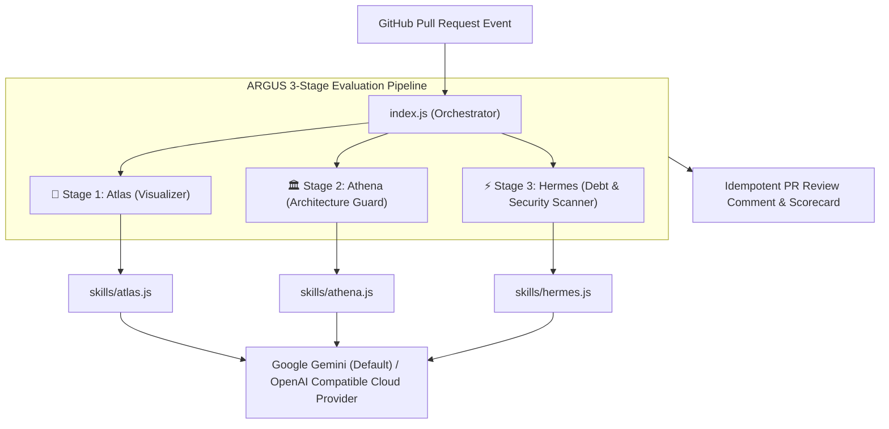

# 👁️ ARGUS — Autonomous 3-Stage AI Code Reviewer & Architecture Guardian

[](https://github.com/Crystal-Studio-Labs/Argus/actions/workflows/ci.yml)
[](https://github.com/marketplace/actions/argus-ai-code-reviewer)
[](https://nodejs.org/)
[](LICENSE)
[](https://sahooshuvranshu.github.io/Argus/)
[](https://dor.gdgkiit.in/)

> **ARGUS** is an autonomous, agentic GitHub Action powered primarily by **Google Gemini** (`gemini-2.0-flash`) with universal OpenAI cloud compatibility. Operating as an automated Senior Software Architect, ARGUS executes a 3-stage evaluation pipeline on Pull Requests to generate visual topology flowcharts, enforce architectural compliance, and catch technical debt before code merges into `main`.

---

## 🛠️ Technology Stack & Engine Architecture

ARGUS is engineered using modern Node.js and AI SDKs to deliver fast, zero-dependency, and cross-provider PR evaluations:

| Layer | Technology Badges | Description |
| :--- | :--- | :--- |
| **Runtime Environment** | [](https://nodejs.org/) [](https://developer.mozilla.org/en-US/docs/Web/JavaScript) | High-performance Node.js 20+ runtime with native async/await and ES2022 module features. |
| **GitHub Automation** | [](https://github.com/actions/toolkit) [](https://octokit.github.io/) | `@actions/core` & `@actions/github` integration for PR diff fetching and idempotent comment lifecycle. |
| **Primary AI Engine** | [](https://ai.google.dev/) | Native `@google/genai` SDK for ultra-fast, 1M token context window LLM inference. |
| **Universal AI Client** | [](https://platform.openai.com/) | Standard `openai` SDK routing to NVIDIA NIM, OpenRouter, Groq Cloud, or custom OpenAI endpoints. |
| **Visualization Engine** | [](https://mermaid.js.org/) | Renders interactive control flow flowcharts (`flowchart TD`) directly inside GitHub markdown. |
| **Testing & Quality** | [](https://nodejs.org/api/test.html) [](tests/skills.test.js) | Native `node --test` suite and `node --check` syntax verification. |

---

## 🏛️ Mythological Origins & Codebase Mapping

The architecture of ARGUS and its three evaluation modules is directly inspired by ancient Greek mythology:

- **👁️ ARGUS (Argus Panoptes - Ἄργος Πανόπτης)**: The 100-eyed all-seeing giant who never slept. In this codebase ([`index.js`](file:///D:/Projects/Argus/index.js)), ARGUS is the 100-eye all-seeing PR reviewer watching over every pull request event to prevent bugs, architectural decay, and unfinished code from slipping into production.
- **🎨 Atlas (Ἄτλας)**: The Titan who holds up the celestial heavens. In this codebase ([`skills/atlas.js`](file:///D:/Projects/Argus/skills/atlas.js)), Atlas parses raw git diffs and draws visual Mermaid.js flowcharts (`flowchart TD`) showing how modified code paths and file structures hold up the system topology.
- **🏛️ Athena (Ἀθηνᾶ)**: The Greek goddess of wisdom and strategy. In this codebase ([`skills/athena.js`](file:///D:/Projects/Argus/skills/athena.js)), Athena acts as the strategic Architecture Guardian, cross-referencing PR code changes against [`architecture.md`](file:///D:/Projects/Argus/architecture.md) rules to enforce clean architectural boundaries.
- **⚡ Hermes (Ἑρμῆς)**: The swift, wing-footed messenger god who inspects hidden corners. In this codebase ([`skills/hermes.js`](file:///D:/Projects/Argus/skills/hermes.js)), Hermes swiftly inspects modified files line-by-line, discovering hidden secrets, `// TODO` comments, debug `console.log` statements, and empty function stubs with severity warning badges (`🔴 BLOCK`, `🟡 WARN`, `🔵 INFO`).

---

## 🗺️ Architectural Workflow



---

## 🌟 3-Stage Evaluation Pipeline

| Stage | Module | Purpose & Output | Output Artifact |
| :--- | :--- | :--- | :--- |
| **🎨 Stage 1: Atlas** | [`skills/atlas.js`](file:///D:/Projects/Argus/skills/atlas.js) | Parses PR diffs into an interactive **Mermaid.js flowchart** (`flowchart TD`) mapping changed files, modules, and control flows. | Collapsible Mermaid.js Topology Flowchart |
| **🏛️ Stage 2: Athena** | [`skills/athena.js`](file:///D:/Projects/Argus/skills/athena.js) | Cross-references code changes against [`architecture.md`](file:///D:/Projects/Argus/architecture.md) rules to prevent architectural decay and layering violations. | Executive Architecture Compliance Report |
| **⚡ Stage 3: Hermes** | [`skills/hermes.js`](file:///D:/Projects/Argus/skills/hermes.js) | Scans changed files for `// TODO`, `// FIXME`, empty placeholder function stubs, debug logs, and hardcoded API keys/secrets with severity badges (`🔴 BLOCK`, `🟡 WARN`, `🔵 INFO`). | Itemized Severity Badges & Line Warnings |

---

## 🌐 Universal AI Cloud Provider Compatibility (Google Gemini Primary Default)

ARGUS is powered by **Google Gemini** (`gemini-2.0-flash`) by default, while supporting **any OpenAI-compatible AI Cloud Provider** out-of-the-box using standard inputs:

| AI Provider | Base URL (`base-url`) | Default / Sample Model (`model`) | Key Required |
| :--- | :--- | :--- | :--- |
| **Google Gemini** *(Default)* | *Not needed (Native SDK)* | `gemini-2.0-flash`, `gemini-1.5-flash` | `gemini-api-key` |
| **OpenAI Direct** | `https://api.openai.com/v1` | `gpt-4o-mini`, `gpt-4o` | `api-key` or `openai-api-key` |
| **NVIDIA NIM** | `https://integrate.api.nvidia.com/v1` | `meta/llama-3.3-70b-instruct` | `api-key` or `nvidia-api-key` |
| **OpenRouter** | `https://openrouter.ai/api/v1` | `google/gemini-2.0-flash-001` | `api-key` or `openrouter-api-key` |
| **Groq Cloud** | `https://api.groq.com/openai/v1` | `llama-3.3-70b-versatile` | `api-key` or `groq-api-key` |

*Note: Includes a built-in **Fallback Static Analysis Engine** that runs automatically if no LLM key is supplied or during network interruptions.*

---

## 🚀 Quick Start & Workflow Setup

Add ARGUS to your repository by creating `.github/workflows/argus.yml`.

### Option A: Google Gemini API (Recommended Default — No `base-url` required)

```yaml
name: ARGUS AI Code Review

on:
  pull_request:
    types: [opened, synchronize, reopened]

jobs:
  argus-review:
    name: ARGUS 3-Stage AI PR Review
    runs-on: ubuntu-latest
    permissions:
      contents: read
      pull-requests: write
      issues: write

    steps:
      - name: Checkout Code
        uses: actions/checkout@v4

      - name: Setup Node.js
        uses: actions/setup-node@v4
        with:
          node-version: 20
          cache: 'npm'

      - name: Install Dependencies
        run: npm ci

      - name: Run ARGUS AI Reviewer (Google Gemini)
        uses: Crystal-Studio-Labs/Argus@main
        with:
          github-token: ${{ secrets.GITHUB_TOKEN }}
          gemini-api-key: ${{ secrets.GEMINI_API_KEY }}
```

---

### Option B: Universal OpenAI-Compatible Cloud Provider (NVIDIA / OpenRouter / Groq / OpenAI)

```yaml
name: ARGUS AI Code Review

on:
  pull_request:
    types: [opened, synchronize, reopened]

jobs:
  argus-review:
    name: ARGUS 3-Stage AI PR Review
    runs-on: ubuntu-latest
    permissions:
      contents: read
      pull-requests: write
      issues: write

    steps:
      - name: Checkout Code
        uses: actions/checkout@v4

      - name: Setup Node.js
        uses: actions/setup-node@v4
        with:
          node-version: 20
          cache: 'npm'

      - name: Install Dependencies
        run: npm ci

      - name: Run ARGUS AI Reviewer (NVIDIA NIM / OpenRouter / Groq)
        uses: Crystal-Studio-Labs/Argus@main
        with:
          github-token: ${{ secrets.GITHUB_TOKEN }}
          api-key: ${{ secrets.NVIDIA_API_KEY }}               # or OPENROUTER_API_KEY / OPENAI_API_KEY
          base-url: "https://integrate.api.nvidia.com/v1"      # or https://openrouter.ai/api/v1 / https://api.groq.com/openai/v1
          model: "meta/llama-3.3-70b-instruct"                 # or google/gemini-2.0-flash-001 / llama-3.3-70b-versatile
```

---

## ⚙️ Action Inputs & Configuration Parameters

| Input Key | Description | Required | Default Value |
| :--- | :--- | :---: | :--- |
| `github-token` | GitHub token for fetching PR diffs and posting review comments | `false` | `${{ github.token }}` |
| `gemini-api-key` | Google Gemini API key (primary default engine) | `false` | *None* |
| `api-key` | Universal API key for Gemini or OpenAI-compatible cloud providers | `false` | *None* |
| `openai-api-key` | Direct OpenAI API key | `false` | *None* |
| `nvidia-api-key` | NVIDIA NIM endpoint API key | `false` | *None* |
| `openrouter-api-key` | OpenRouter API key | `false` | *None* |
| `groq-api-key` | Groq Cloud API key | `false` | *None* |
| `base-url` | Custom REST endpoint URL for OpenAI-compatible providers | `false` | *None* |
| `model` | AI model identifier string | `false` | `gemini-2.0-flash` |

---

## 📂 Repository Directory Tree

```
├── .github/
│   └── workflows/
│       ├── argus.yml          # ARGUS PR review workflow trigger
│       └── ci.yml             # Repository CI pipeline (lint, test, structure check)
├── skills/
│   ├── atlas.js               # Stage 1: Visual topology mapper (Git diff -> Mermaid.js)
│   ├── athena.js              # Stage 2: Architecture compliance guard
│   └── hermes.js              # Stage 3: Technical debt, secret, and stub function scanner
├── tests/
│   └── skills.test.js         # Native unit test suite (node --test)
├── showcase/                  # Live Showcase Website source files (HTML/CSS/JS)
│   ├── index.html             # Landing page & live PR evaluation sandbox
│   ├── documentation.html     # Setup manuals & provider configuration guides
│   ├── styles.css             # ARGUS Greek Mythology Brutalism system styles
│   └── app.js                 # Interactive playground simulator logic
├── docs/                      # GitHub Pages documentation entry point
├── action.yml                 # GitHub Action metadata declaration
├── architecture.md            # Tech stack & 3-stage evaluation specification
├── AGENTS.md                  # Agent constitution, operating rules, and rule matrix
├── AGENTS_AND_SKILLS.md       # ARGUS custom agent and skills contract
├── index.js                   # Core GitHub Action orchestrator script
├── package.json               # Dependencies and script definitions
├── README.md                  # Master documentation and quick start guide
├── SECURITY.md                # Security disclosure policy and contact
├── CONTRIBUTING.md            # Contributor guidelines and environment setup
└── CODE_OF_CONDUCT.md         # Community pledge and enforcement rules
```

---

## 🧪 Local Setup & Test Execution

```bash
# Clone the repository
git clone https://github.com/Crystal-Studio-Labs/Argus.git
cd Argus

# Install dependencies
npm install

# Run syntax linting
npm run lint

# Run native test suite (node --test)
npm test
```

---

## 📬 Contact & Support

ARGUS is developed and maintained by **SahooShuvranshu** and **Crystal Studio Labs**:
- **Developer Website**: [sahooshuvranshu.is-a.dev](https://sahooshuvranshu.is-a.dev)
- **Organization**: [Crystal Studio Labs](https://github.com/Crystal-Studio-Labs)
- **GitHub Repository**: [Crystal-Studio-Labs/Argus](https://github.com/Crystal-Studio-Labs/Argus)
- **Email Support**: [contact@sahooshuvranshu.is-a.dev](mailto:contact@sahooshuvranshu.is-a.dev)