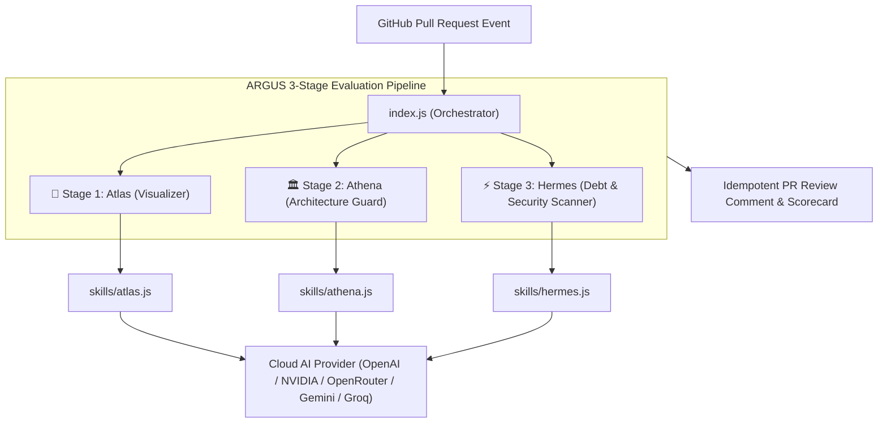

# 👁️ ARGUS — AI-Powered GitHub Action for Automated Code Reviews

[](https://github.com/SahooShuvranshu/Argus/actions/workflows/ci.yml)
[](https://github.com/marketplace/actions/argus-ai-pr-reviewer)
[](https://nodejs.org/)
[](LICENSE)
[](https://github.com/SahooShuvranshu/Argus)

> **ARGUS** is an autonomous, agentic GitHub Action built for **Track B (Developer Productivity Tools)** in the Agent-Driven Software Lifecycle (ADLC) hackathon. Operating as an automated Senior Software Architect, ARGUS executes a 3-stage review pipeline on Pull Requests to generate visual topology flowcharts, enforce architectural compliance, and catch technical debt before code merges into `main`.

---

## 🗺️ Architectural Workflow



---

## 🌟 3-Stage Evaluation Pipeline

| Stage | Module | Purpose & Output |
| :--- | :--- | :--- |
| **🎨 Stage 1: Atlas** | [`skills/atlas.js`](file:///D:/Projects/Argus/skills/atlas.js) | Parses PR diffs into an interactive **Mermaid.js flowchart** (`flowchart TD`) mapping changed files, modules, and control flows. |
| **🏛️ Stage 2: Athena** | [`skills/athena.js`](file:///D:/Projects/Argus/skills/athena.js) | Cross-references code changes against [`architecture.md`](file:///D:/Projects/Argus/architecture.md) rules to prevent architectural decay and layering violations. |
| **⚡ Stage 3: Hermes** | [`skills/hermes.js`](file:///D:/Projects/Argus/skills/hermes.js) | Scans changed files for `// TODO`, `// FIXME`, empty placeholder functions, debug logs, and hardcoded API keys/secrets with severity badges (`🔴 BLOCK`, `🟡 WARN`, `🔵 INFO`). |

---

## 🌐 Universal AI Cloud Provider Compatibility

ARGUS supports **any OpenAI-compatible AI Cloud Provider** out-of-the-box using standard inputs:

| AI Provider | Base URL (`base-url`) | Default / Sample Model (`model`) |
| :--- | :--- | :--- |
| **OpenAI** | `https://api.openai.com/v1` *(default)* | `gpt-4o-mini`, `gpt-4o` |
| **NVIDIA NIM** | `https://integrate.api.nvidia.com/v1` | `meta/llama-3.3-70b-instruct`, `nvidia/llama-3.1-nemotron-70b-instruct` |
| **OpenRouter** | `https://openrouter.ai/api/v1` | `google/gemini-2.0-flash-001`, `deepseek/deepseek-r1` |
| **Groq** | `https://api.groq.com/openai/v1` | `llama-3.3-70b-versatile` |
| **Google Gemini** | Native SDK / OpenAI Endpoint | `gemini-2.0-flash`, `gemini-1.5-flash` |

*Note: Includes a built-in **Fallback Static Analysis Engine** that runs automatically if no LLM key is supplied or during network interruptions.*

---

## 🚀 Quick Start & Workflow Usage

Add ARGUS to your repository by creating `.github/workflows/argus.yml`:

```yaml
name: ARGUS AI Code Review

on:
  pull_request:
    types: [opened, synchronize, reopened]

jobs:
  argus-review:
    name: ARGUS 3-Stage AI PR Review
    runs-on: ubuntu-latest
    permissions:
      contents: read
      pull-requests: write
      issues: write

    steps:
      - name: Checkout Code
        uses: actions/checkout@v4

      - name: Setup Node.js
        uses: actions/setup-node@v4
        with:
          node-version: 20
          cache: 'npm'

      - name: Install Dependencies
        run: npm ci

      - name: Run ARGUS AI Reviewer
        uses: SahooShuvranshu/Argus@main
        with:
          github-token: ${{ secrets.GITHUB_TOKEN }}
          api-key: ${{ secrets.AI_API_KEY || secrets.GEMINI_API_KEY }}
          base-url: "https://api.openai.com/v1" # Optional: OpenAI-compatible endpoint
          model: "gpt-4o-mini"                  # Optional: AI model choice
```

---

## 📂 Repository Directory Tree

```
├── .github/
│   └── workflows/
│       ├── argus.yml          # ARGUS PR review workflow trigger
│       └── ci.yml             # Repository CI pipeline (lint, test, structure check)
├── skills/
│   ├── atlas.js               # Visual topology mapper (Git diff -> Mermaid.js)
│   ├── athena.js              # Architecture compliance guard
│   └── hermes.js              # Technical debt, secret, and stub function scanner
├── tests/
│   └── skills.test.js         # Native unit test suite (node --test)
├── action.yml                 # GitHub Action metadata declaration
├── architecture.md            # Tech stack & 3-stage evaluation specification
├── AGENTS.md                  # Agent constitution, operating rules, and rule matrix
├── AGENTS_AND_SKILLS.md       # ARGUS custom agent and skills contract
├── index.js                   # Core GitHub Action orchestrator script
├── package.json               # Dependencies and script definitions
├── README.md                  # Master documentation and quick start guide
├── SECURITY.md                # Security disclosure policy and contact
├── CONTRIBUTING.md            # Contributor guidelines and environment setup
└── CODE_OF_CONDUCT.md         # Community pledge and enforcement rules
```

---

## 🧪 Local Setup & Test Execution

```bash
# Clone the repository
git clone https://github.com/SahooShuvranshu/Argus.git
cd Argus

# Install dependencies
npm install

# Run syntax linting
npm run lint

# Run native test suite (node --test)
npm test
```

---

## 📄 Documentation & Community Policies

- 📜 [**Architecture Specification**](architecture.md): Detailed tech stack, data flow, and pipeline architecture.
- ⚖️ [**Agent Constitution**](AGENTS.md): Core operating principles, constraints, and rule matrix (`ARGUS-01`, `ARGUS-02`, `ARGUS-03`).
- 🤖 [**Custom Agent & Skills System**](AGENTS_AND_SKILLS.md): Skill interface definitions for Atlas, Athena, and Hermes.
- 🤝 [**Contributing Guidelines**](CONTRIBUTING.md): Guide for contributors and development setup.
- 🛡️ [**Security Policy**](SECURITY.md): Security reporting procedures and supported versions.
- 📜 [**Code of Conduct**](CODE_OF_CONDUCT.md): Community standards and pledge.

---

## 📬 Contact & Support

For inquiries, support, or security reports, please contact:
- **Email**: [contact@sahooshuvranshu.is-a.dev](mailto:contact@sahooshuvranshu.is-a.dev)
- **Repository Owner**: [SahooShuvranshu](https://github.com/SahooShuvranshu)

---
*Developed for Track B (Developer Productivity Tools) of the Agent-Driven Software Lifecycle Hackathon.*