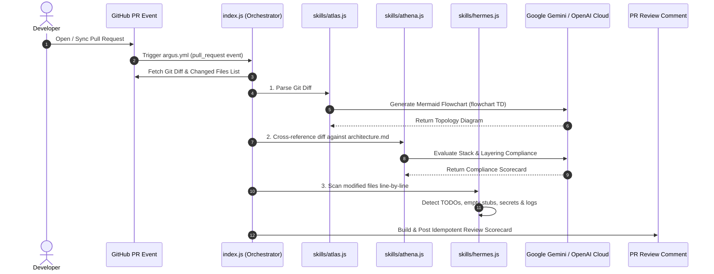

# 🏛️ ARGUS Architecture & System Specification

## 1. System Overview & Problem Statement
Manual Pull Request (PR) reviews are a major bottleneck in modern continuous delivery pipelines. Senior developers spend significant hours inspecting diffs, checking architectural compliance, and hunting for unfinished code stubs or security leaks.

**ARGUS** solves this bottleneck by operating as an automated Senior Software Architect GitHub Action. It executes an autonomous 3-stage evaluation pipeline—**Atlas** (Visual Impact Topology), **Athena** (Architecture Guard), and **Hermes** (Technical Debt & Security Scanner)—posting an idempotent executive scorecard directly to the PR discussion thread.

---

## 2. Technology Stack & Component Architecture

### Runtime & Workflow Layer
* **Runtime**: Node.js 20+ (`using: 'node20'` in `action.yml`).
* **Automation Framework**: `@actions/core` (inputs/outputs, failure reporting) & `@actions/github` (Octokit REST Client for PR diffs and comment lifecycle).

### Universal AI Cloud Provider Compatibility
ARGUS supports **Google Gemini** (`gemini-2.0-flash`) natively as its default primary engine, while seamlessly supporting **any OpenAI-compatible REST endpoint**:
- **Google Gemini**: Native `@google/genai` SDK (`gemini-2.0-flash`).
- **NVIDIA NIM**: `https://integrate.api.nvidia.com/v1` (`meta/llama-3.3-70b-instruct`).
- **OpenRouter**: `https://openrouter.ai/api/v1` (`google/gemini-2.0-flash-001`).
- **Groq Cloud**: `https://api.groq.com/openai/v1` (`llama-3.3-70b-versatile`).
- **OpenAI Direct**: `https://api.openai.com/v1` (`gpt-4o-mini`).

---

## 3. Data Model & Sequence Workflow

---

## 4. 3-Stage Evaluation Pipeline Mechanics

### 🎨 Stage 1: Atlas (Visual Impact Topology)
- **Module**: `skills/atlas.js`
- **Function**: `generateTopologyMap(diffText, aiClient, modelName)`
- **Behavior**: Converts raw PR git diffs into an interactive **Mermaid.js flowchart** (`flowchart TD`) mapping modified modules, dependencies, and control flows.
- **Output**: Collapsible Mermaid diagram rendered in the PR comment.

### 🏛️ Stage 2: Athena (Architecture Compliance Guard)
- **Module**: `skills/athena.js`
- **Function**: `evaluateArchitecture(diffText, architectureDocs, aiClient, modelName)`
- **Behavior**: Reads the repository's `architecture.md` rules and evaluates whether new code changes comply with stack declarations and modular layering boundaries.
- **Output**: Executive architecture compliance status (`✅ COMPLIANT` or `⚠️ VIOLATIONS DETECTED`) and itemized notice list.

### ⚡ Stage 3: Hermes (Technical Debt & Security Scanner)
- **Module**: `skills/hermes.js`
- **Function**: `detectTechnicalDebt(fileContentsMap, aiClient, modelName)`
- **Behavior**: Performs line-by-line inspection of modified files looking for:
  - `🔴 BLOCK`: Hardcoded secret keys, API tokens, or critical security vulnerabilities.
  - `🟡 WARN`: Unfinished `// TODO`, `// FIXME`, `throw new Error("Not implemented")`, or empty routine stubs.
  - `🔵 INFO`: Debugging statements (e.g. `console.log`).
- **Output**: Formatted severity table with precise line numbers and file paths.

---

## 5. Defensive Error Handling & Fallback Strategy

ARGUS is engineered to **never break a repository's CI pipeline**:
- **Malformed/Empty Diffs**: If git diff data is empty or unreadable, Atlas returns a fallback root topology node without crashing.
- **API Rate Limits (HTTP 429) & Network Outages**: If the AI model key reaches quota limits or network errors occur, ARGUS seamlessly activates its built-in **Fallback Static Analysis Engine**, completing the 3-stage evaluation using static regex parsing rules.
- **Idempotency Safeguard**: Searches PR comments for marker `<!-- ARGUS-REVIEW-COMMENT -->` to update existing comments rather than creating thread clutter.
